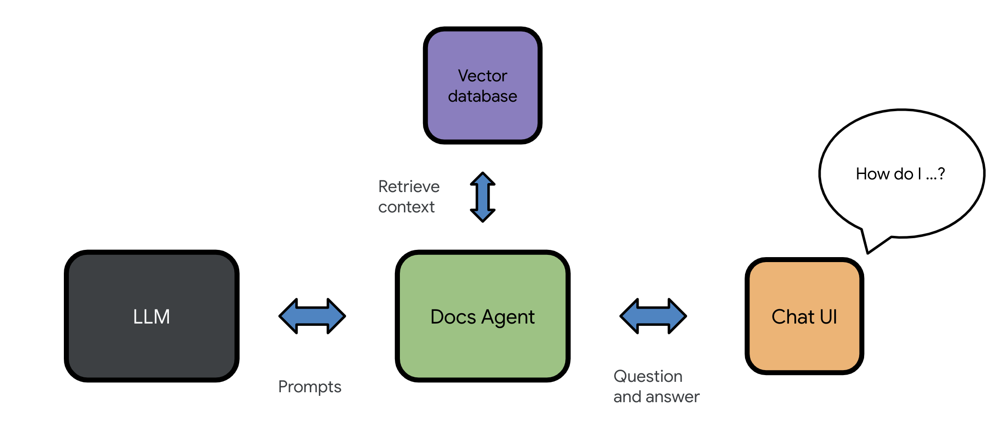
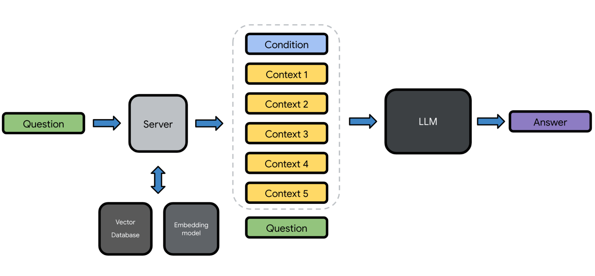
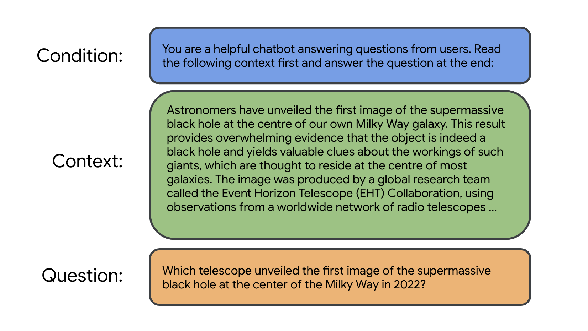
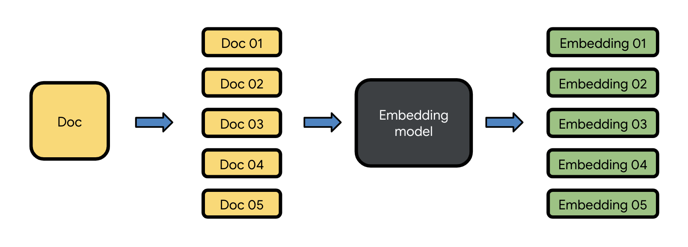
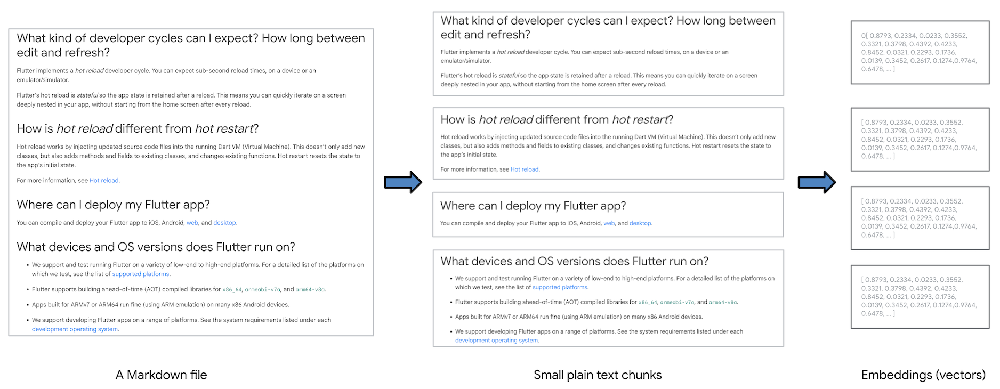
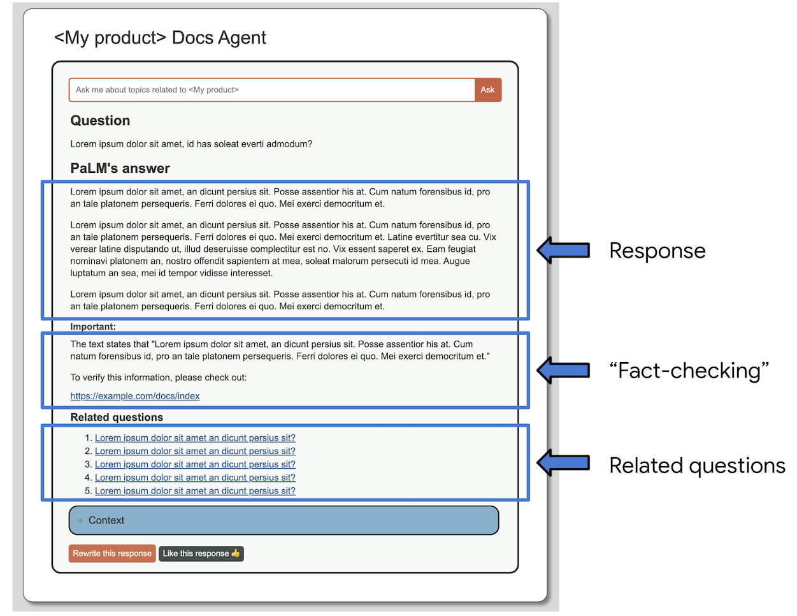
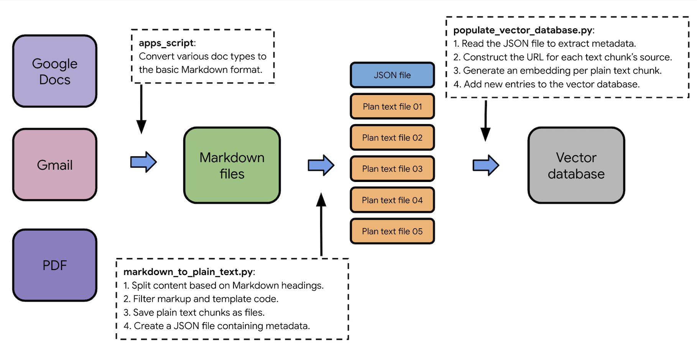

# Docs Agent

The Docs Agent project enables [PaLM API][genai-doc-site] users to launch a chat application
on a Linux host machine using their documents as a dataset.

**Note**: If you want to set up and launch the Docs Agent sample app on your host machine,
check out the [Set up Docs Agent][set-up-docs-agent] section below.

## Overview

The Docs Agent project is being developed to demonstrate an AI-powered chatbot application
(including a backend server and web UI) that can answer questions specific to any product,
service, or topic that has a large amount of information available in documentation (which
can be from various sources such as Markdown, HTML, Google Docs, Gmail, PDF, etc.).

The main goal of the Docs Agent project is:

- You can supply your own set of documents to enable a PaLM 2 model to generate useful,
  relevant, and accurate responses that are grounded on the documented information.

The Docs Agent sample app is designed to be easily set up and configured in a Linux environment
and is required that you have access to Google’s [PaLM API][genai-doc-site].

Keep in mind that this approach does not involve “fine-tuning” an LLM (large language model).
Instead, the Docs Agent sample app uses a mixture of prompt engineering and embedding techniques,
also known as Retrieval Augmented Generation (RAG), on top of a publicly available LLM model
like  PaLM 2.



**Figure 1**. Docs Agent uses a vector database to retrieve context for augmenting prompts.

## Main features

The key features of the Docs Agent sample app are:

- Add context to user questions to augment their prompts to an LLM.
- Process documents into embeddings and store them in a vector database for context retrieval.



**Figure 2**. A user question is augmented by the Docs Agent server and passed to an LLM.

**Note**: For the moment, the Docs Agent project focuses on providing Python scripts that make it
easy to process Markdown files into embeddings. However, there is no hard requirement that the
source documents must exist in Markdown format. What’s important is that the processed content
is available as embeddings in the vector database.

### Structure of a prompt to a PaLM 2 model

To enable an LLM to answer questions that are not part of the public knowledge (which the LLM
is likely trained on), the Docs Agent project applies a mixture of prompt engineering and
embeddings techniques. That is, we process a set of documents (which contain domain specific
knowledge) into embeddings and store them in a vector database. This vector database allows
the Docs Agent server to perform semantic search on stored embeddings to find the most relevant
content from the source documents given user questions.

Once the most relevant content is returned, the Docs Agent server uses the prompt structure
shown in Figure 3 to augment the user question with a preset **condition** and a list of
**context**. (When the Docs Agent server starts, the condition value is read from the
[`config.yaml`][config-yaml] file.) Then the Docs Agent server sends this prompt to a
PaLM 2 model using the PaLM API and receives a response generated by the model.



**Figure 3**. Prompt structure for augmenting a user question with related context
(Context source: [eventhorizontelescope.org][context-source-01])

### Processing of Markdown files into embeddings

To process information into embeddings using the Python scripts in the project, the
information needs to be stored in Markdown format. Once you have a set of Markdown files
stored in a directory on your host machine,  you can run the
[`markdown_to_plain_text.py`][markdown-to-plain-text] script to process those Markdown
files into small plain text files – the script splits the content by the top three Markdown
headers (`#`, `##`, and `###`).

Once Markdown files are processed into small plain text files, you can run the
[`populate_vector_database.py`][populate-vector-database] script to generate embeddings
for each text file and store those embeddings into a [Chroma][chroma-docs] vector database
running on the host machine.

The embeddings in this vector database enable the Docs Agent server to perform semantic search
and retrieve context related to user questions for augmenting prompts.

For more information on the processing of Markdown files, see the [`README`][scripts-readme]
file in the `scripts` directory.



**Figure 4**. A document is split into small semantic chunks, which are then used to generate
embeddings.



**Figure 5**. A Markdown page is split by headers and processed into embeddings.

## Summary of tasks and features

The following list summarizes the tasks and features of the Docs Agent sample app:

- **Process Markdown**: Split Markdown files into small plain text files. (See the
  [`markdown_to_plain_text.py`][markdown-to-plain-text] script.)
- **Generate embeddings**: Use small plain text files to generate embeddings, processed by
  an embedding model (`embedding-gecko-001`), and store them in a local Chroma vector
  database. (See the [`populate_vector_database.py`][populate-vector-database] script.)
- **Semantic search using embeddings**: Compare embeddings in the vector database for most
  relevant content given user questions (which are also processed into embeddings using
  the same `embedding-gecko-001` model).
- **Add context to a user question in a prompt**: Add the list of content returned from
  the semantic search as context to the user question and send the prompt to a PaLM 2
  model using the PaLM API.
- **(Experimental) “Fact-check” responses**: This experimental feature composes a
  follow-up prompt and asks the PaLM 2 model to “fact-check” its own previous response.
  (See the [Using a PaLM 2 model to fact-check its own response][fact-check-section] section.)
- **Generate 5 related questions**: In addition to displaying a response to the user
  question, the web UI displays five questions generated by the PaLM 2 model based on
  the context of the user question. (See the
  [Using a PaLM 2 model to suggest related questions][related-questions-section] section.)
- **Display URLs of knowledge sources**: The vector database stores URLs as metadata for
  embeddings. Whenever the vector database is used to retrieve context (for instance, to
  provide context to user questions), the database can also return the URLs of the sources
  that were originally used to generate the embeddings.
- **Submit rewrites and likes**: The web UI includes the buttons at the bottom of the
  display that allow users to like generated responses or submit rewrites of
  the responses. (See the
  [Enabling users to submit a rewrite of a generated response][submit-a-rewrite] and
  [Enabling users to like generated responses][like-generate-responses] sections.)
- **Convert Google Docs, PDF, and Gmail into Markdown files**: This feature uses
  Apps Script to convert Google Docs, PDF, and Gmail into Markdown files, which then
  can be used as input datasets for Docs Agent. For more information, see the
  [`README`][apps-script-readme] file in the `apps_script` directory.

## Flow of events

The following events take place in the Docs Agent sample app:

1. The [`markdown_to_plain_text.py`][markdown-to-plain-text] script converts input
   Markdown documents into small plain text files, split by Markdown headings
   (`#`, `##`, and `###`).
2. The [`populate_vector_database.py`][populate-vector-database] script generates
   embeddings from the small plain text files and populates a vector database.
3. When the [`chatbot/launch.sh`][launch-script] script is run, it starts the
   Docs Agent server and vector database, which loads generated embeddings and
   metadata (URLs and filenames) stored in the `vector_store` directory.
4. When the user asks a question, the Docs Agent server uses the vector database to
   perform semantic search on embeddings, which represent content in the source
   documents.
5. Using this semantic search capability, the Docs Agent server finds a list of
   text chunks that are most relevant to the user question.
6. The Docs Agent server adds this list of text chunks as context (plus a condition
   for responses) to the user question and constructs them into a prompt.
7. The system sends the prompt to a PaLM 2 model via the PaLM API.
8. The PaLM 2 model generates a response and the Docs Agent server renders it on
   the chat UI.

Additional events for [“fact-checking” a generated response][fact-check-section]:

9. The Docs Agent server prepares another prompt that compares the generated response
   (in step 8) to the context (in step 6) and asks the PaLM model to look for
   a discrepancy in the response.
10. The PaLM model generates a response that points out one major discrepancy
    (if it exists) between its previous response and the context.
11. The Docs Agent server renders this response on the chat UI as a call-out note.
12. The Docs Agent server passes this second response to the vector database to
    perform semantic search.
13. The vector database returns a list of relevant content (that is closely related
    to the second response).
14. The Docs Agent server renders the top URL of this list on the chat UI and
    suggests that the user checks out this URL for fact-checking.

Additional events for
[suggesting 5 questions related to the user question][related-questions-section]:

15. The Docs Agent server prepares another prompt that asks the PaLM model to
    generate 5 questions based on the context (in step 6).
16. The PaLM model generates a response that contains a list of questions related
    to the context.
17. The Docs Agent server renders the questions on the chat UI.

## Supplementary features

This section describes additional features implemented on the Docs Agent sample app for
enhancing the usability of the Q&A experience powered by generative AI.



**Figure 6**. A screenshot of the Docs Agent chat UI showing the sections generated by
three distinct prompts.

### Using a PaLM 2 model to fact-check its own response

In addition to using the prompt structure above (shown in Figure 3), we‘re currently
experimenting with the following prompt setup for “fact-checking” responses generated
by the PaLM model:

- Condition:

  ```
  You are a helpful chatbot answering questions from users. Read the following context
  first and answer the question at the end:
  ```

- Context:

  ```
  <CONTEXT_USED_IN_THE_PREVIOUS_PROMPT>
  ```

- Additional condition (for fact-checking):

  ```
  Can you compare the text below to the context provided
  in this prompt above and write a short message that warns the readers about
  which part of the text they should consider fact-checking? (Please keep your
  response concise and focus on only one important item.)"
  ```

- Previously generated response

  ```
  Text: <RESPONSE_RETURNED_FROM_THE_PREVIOUS_PROMPT>
  ```

This "fact-checking" prompt returns a response similar to the following example:

```
The text states that Flutter chose to use Dart because it is a fast, productive, object-oriented
language that is well-suited for building user interfaces. However, the context provided in the
prompt states that Flutter chose Dart because it is a fast, productive language that is well-suited
for Flutter's problem domain: creating visual user experiences. Therefore, readers should consider
fact-checking the claim that Dart is well-suited for building user interfaces.
```

After the second response, notice that the Docs Agent chat UI also suggests a URL to visit for
fact-checking  (see Figure 6), which looks similar to the following example:

```
To verify this information, please check out:

https://docs.flutter.dev/resources/faq
```

To identify this URL, the Docs Agent server takes the second response (which is the paragraph that
begins with “The text states that ...” in the example above) and uses it to query the vector
database. Once the vector database returns a list of the most relevant content to this response,
the UI only displays the top URL to the user.

Keep in mind that this "fact-checking" prompt setup is currently considered **experimental**
because we‘ve seen cases where a PaLM model would end up adding incorrect information into its
second response as well. However, we saw that adding this second response (which brings attention
to the PaLM model’s possible hallucinations) seems to improve the usability of the system since it
serves as a reminder to the users that the PaLM model‘s response is far from being perfect, which
helps encourage the users to take more steps to validate generated responses for themselves.

### Using a PaLM 2 model to suggest related questions

The project‘s latest web UI includes the “Related questions” section, which displays five
questions that are related to the user question (see Figure 6). These five questions are also
generated by a PaLM model (via the PaLM API). Using the list of contents returned from the vector
database as context, the system prepares another prompt asking the PaLM model to generate five
questions from the included context.

The following is the exact structure of this prompt:

- Condition:

  ```
  You are a helpful chatbot answering questions from users. Read the following context first
  and answer the question at the end:
  ```

- Context:

  ```
  <CONTEXT_USED_IN_THE_PREVIOUS_PROMPT>
  ```

- Question:

  ```
  What are 5 questions developers might ask after reading the context?
  ```

### Enabling users to submit a rewrite of a generated response

The project‘s latest web UI includes the **Rewrite this response** button at the bottom of
the panel (see Figure 6). When this button is clicked, a widget opens up, expanding the
main UI panel, and reveals a textarea containing the generated response to the user's question.
The user is then allowed to edit this response in the textarea and click the **Submit** button
to submit the updated response to the system.

The system stores the submitted response as a Markdown file in the project's local `rewrites`
directory. The user may re-click the **Submit** button to update the submitted rewrite multiple
times.

### Enabling users to like generated responses

The project's latest web UI includes the **Like this response** button at the bottom of the panel
(see Figure 6). When this button is clicked, the server logs the event of "like" for the response.
However, clicking the **Liked** button again will reset the button. Then the server logs this reset
event of "like" for the response.

The user may click this like button multiple times to toggle the state of the like button. But when
examining the logs, only the final state of the like button will be considered for the response.

### Using Google Docs, PDF, or Gmail as input sources

The project includes Apps Script files that allow you to convert various sources of content
(including Google Docs and PDF) from your Google Drive and Gmail into Markdown files. You can then
use these Markdown files as additional input sources for Docs Agent. For more information, see the
[`README`][apps-script-readme] file in the `apps_script` directory.



**Figure 7**. Docs Agent's pre-processing flow for various doc types.

## Issues identified

The following issues have been identified and need to be worked on:

- **Logical content chunking**: When splitting documents, content is divided into chunks only by the
  current 1500-character limit. This approach splits large docs into small chunks, which results in
  losing context, especially in large how-to guides with a long sequence of instructions. **[Done]**
- **Clean plain text for embeddings**: The current Markdown processing method doesn’t fully filter
  out all Markdown and HTML syntax, which seems to have a negative influence on embeddings.
- **Database support for embeddings**: The system needs a proper database setup for faster lookup
  and for enabling us to store metadata (such as URLs) next to embeddings. **[Done]**
- **Better prompting**: We haven’t widely explored all best practices in prompting. Also consider
  supporting dynamic prompting given user questions.
- **Real-world feedback**: We need to set up a feedback loop to collect real-world user
  interactions, including example prompts and responses, and start using them as part of embeddings.

## Set up Docs Agent

This section provides instructions on how to set up the Docs Agent project on a Linux host machine.

### 1. Prerequisites

1. Update the Linux package repositories on the host machine:

   ```posix-terminal
   sudo apt update
   ```

2. Install the following dependencies:

   ```posix-terminal
   sudo apt install git pip python3-venv
   ```

3. Install `poetry`:

   ```posix-terminal
   curl -sSL https://install.python-poetry.org | python3 -
   ```

   **Important**: Make sure that `$HOME/.local/bin` is in your `PATH` variable.

4. Set the following environment variable:

   ```posix-terminal
   export PYTHON_KEYRING_BACKEND=keyring.backends.null.Keyring
   ```

   This is a [known issue][poetry-known-issue] in `poetry`.

5. Set the PaLM API key as a environment variable:

   ```
   export PALM_API_KEY=<YOUR_API_KEY_HERE>
   ```

   Replace `<YOUR_API_KEY_HERE>` with the API key to
   [Generative Language API][genai-doc-site].

   **Tip**: To avoid repeating these `export` lines, add them to your
   `$HOME/.bashrc` file.

### 2. Clone this project repository and install dependencies

**Note**: This guide assumes that you're cloning the `generative-ai-docs` repository
from your `$HOME` directory.

1. Clone the `generative-ai-docs` repository, for example:

   ```posix-terminal
   git clone https://github.com/google/generative-ai-docs
   ```

2. Go to the Docs Agent project directory:

   ```posix-terminal
   cd ./generative-ai-docs/demos/palm/python/docs-agent
   ```

4. Install dependencies using `poetry`:

   ```posix-terminal
   poetry install
   ```

   This may take some time to complete.

5. Enter the `poetry` shell environment:

   ```posix-terminal
   poetry shell
   ```

   **Important**: From this point, all command lines in the sections below need to run
   in this `poetry shell` environment.


Now, the next step is to populate a vector database with your own documents. See the
[Populate a new vector database from Markdown files][populate-db-steps] section below.

## Populate a new vector database from Markdown files

This section provides instructions on how to bring your own set of documents and create and
populate a vector database (`vector_stores/chroma`) on your host machine. The Python scripts
in the project's `scripts` directory can help you populate documents, embeddings and metadata
from Markdown files (`.md`).

This section uses the [open source Flutter documents][flutter-docs-src] as an example dataset,
which are the source Markdown files for the [Flutter website][flutter-docs-site]. To download
the open source Flutter documents on your host machine, run the following command:

```
git clone --recurse-submodules https://github.com/flutter/website.git
```

**Note**: The Flutter documents are used in this section as an example dataset only. The
Python scripts below are designed to work with any documents in the standard Markdown format.

### 1. Convert Markdown files to plain text files

Before generating embeddings, you need to process Markdown files into small chunks of
plain text files.

To convert Markdown files to plain text files:

1. Go to the Docs Agent project directory, for example:

   ```
   cd $HOME/generative-ai-docs/demos/palm/python/docs-agent
   ```

2. Open the [`config.yaml`][config-yaml] file using a text editor, for example:

   ```
   nano config.yaml
   ```

3. (**Optional**) Edit `output_path` to a directory that will store plain text files,
   for example:

   ```
   output_path: "data/plain_docs"
   ```

   The example above creates a new directory named `data/plain_docs` in the current project
   directory (which results in `generative-ai-docs/demos/palm/python/docs-agent/data/plain_docs`).
   Then the project uses this `output_path` directory to store the plain text files processed
   from the input Markdown files.

4. Under the `input` field, define the following entries to specify the directories
   that contain your source Markdown files.

   - `path`: The directory where the source Markdown files are stored.
   - `url_prefix`: The prefix used to create URLs for the source Markdown files.
     If the URLs do not exist for the source files, provide a mock string.
   - (**Optional**) `exclude_path`: The sub-directory to be excluded from
     the path directory.

   The example below shows the entries for the Flutter documents downloaded on the
   host machine (that is, in the `/home/downloads/website` directory):

   ```
   input:
     - path: "/home/downloads/website/src"
       url_prefix: "https://docs.flutter.dev"
   ```

   You can also provide a number of input directories (`path` and `url_prefix` sets) under
   the input field, for example:

   ```
   input:
     - path: "/home/downloads/website/src/ui"
       url_prefix: "https://docs.flutter.dev/ui"
     - path: "/home/downloads/website/src/codelabs"
       url_prefix: "https://docs.flutter.dev/codelabs"
   ```

5. Save the file and exit the text editor.

6. Run the Python script:

   ```
   python3 scripts/markdown_to_plain_text.py
   ```

   For a large number of Markdown files, it may take a few minutes to process
   Markdown files.

### 2. Populate a new vector database

Once you have plain text files processed and stored in the `output_path` directory,
you can run the `populat_vector_database.py` script to populate a vector database
with the contents of the plain text files and their embeddings (and metadata).

**Important**: For a clean setup, if the `vector_stores/chroma` directory already
exists, delete (or move) the `chroma` directory before populating a new vector
database. (Otherwise, new entries will be added to your existing vector database.)
Also, if the Docs Agent chat app is already running using this `chroma` directory,
shut down the app before deleting the directory.

To populate a new vector database:

1. Go to the Docs Agent project directory, for example:

   ```
   cd $HOME/generative-ai-docs/demos/palm/python/docs-agent
   ```

2. Create and populate a new vector database:

   ```
   python3 ./scripts/populate_vector_database.py
   ```

   This script uses the `output_path` directory from the `config.yaml` file to locate
   plain text files and creates a new directory at
   `generative-ai-docs/demos/palm/python/docs-agent/vector_stores/chroma`, which
   contains embeddings and metadata.

3. To test the new vector database, run the following script:

   ```
   python3 ./scripts/test_vector_database.py
   ```

   **Note**: Adjust `QUESTION` in `scripts/test_vector_database.py` to be suitable for
   the content in your database.

The next step is to launch the Docs Agent chat app to use the new vector database. See
the [Start the Docs Agent chat app][start-the-app-steps] section below.

## Start the Docs Agent chat app

**Important**: This section assumes that you've already created a `vector_stores/chroma`
directory, which contains artifacts for the vector database. If you haven't, see the
[Populate a new vector database from Markdown files][populate-db-steps] section above.

This Flask app lets users interact with the Docs Agent service through a web browser. The
`launch.sh` script deploys the Flask app in a Python virtual environment (`poetry`),
allowing you to easily bring up and destory the Flask app instance.

### 1. Configure the Docs Agent chat app

To customize settings in the Docs Agent chat app, do the following:

1. Edit the [`config.yaml`][config-yaml] file to update the following field:

   ```
   product_name: "My product"
   ```

   Replace `My product` with your product name (which shows up as the main label on the UI),
   for example:

   ```
   product_name: "Flutter"
   ```

2. (**Optional**) Edit the `config.yaml` file to provide a more specific prompt
   condition for your custom dataset, for example:

   ```
   condition_text: "You are a helpful chatbot answering questions from developers working on
   Flutter apps. Read the following context first and answer the question at the end:"
   ```

### 2. Launch the Docs Agent chat app

To launch the Docs Agent chat app, do the following:

1. Go to the Docs Agent project directory, for example:

   ```
   cd $HOME/generative-ai-docs/demos/palm/python/docs-agent
   ```

2. Launch the Docs Agent chat app:

   ```
   poetry run ./chatbot/launch.sh
   ```

   **Note**: The Docs Agent chat app runs on port 5000 by default. If you have an application
   already running on port 5000 on your host machine, you can use the `-p` flag to specify
   a different port (for example, `poetry run ./chatbot/launch.sh -p 5050`).

   Once the app starts running, this command prints output similar to the following:

   ```
   $ poetry run ./chatbot/launch.sh
   Reading the config file: /home/alice/docs-agent/config.yaml
   Reading the config file: /home/alice/docs-agent/config.yaml
    * Serving Flask app 'chatbot'
    * Debug mode: on
   INFO:werkzeug:WARNING: This is a development server. Do not use it in a production deployment. Use a production WSGI server instead.
    * Running on http://example.com:5000
   INFO:werkzeug:Press CTRL+C to quit
   INFO:werkzeug: * Restarting with stat
   Reading the config file: /home/alice/docs-agent/config.yaml
   Reading the config file: /home/alice/docs-agent/config.yaml
   WARNING:werkzeug: * Debugger is active!
   INFO:werkzeug: * Debugger PIN: 825-594-989
   ```

   Notice the line that shows the URL of this server (`http://example.com:5000` in
   the example above).

3. Open the URL above on a browser.

   Now, users can start asking questions related to the source dataset.

**The Docs Agent chat app is all set!**

## Contribute to Docs Agent

To contribute to the Docs Agent project, do the following:

1. Visit https://cla.developers.google.com/ to see your current agreements
   or to sign a new one.

2. Fork the [`generative-ai-docs`][gen-ai-docs-repo] repository.

3. Make changes in your forked reposiotry.

4. Create a pull request.

## Contributors

Nick Van der Auwermeulen (`@nickvander`), Rundong Du (`@rundong08`),
Meggin Kearney (`@Meggin`), and Kyo Lee (`@kyolee415`).

<!-- Reference links -->

[contribute-to-docs-agent]: #contribute-to-docs-agent
[set-up-docs-agent]: #set-up-docs-agent
[markdown-to-plain-text]: ./scripts/markdown_to_plain_text.py
[populate-vector-database]: ./scripts/populate_vector_database.py
[context-source-01]: http://eventhorizontelescope.org
[fact-check-section]: #using-a-palm-2-model-to-fact-check-its-own-response
[related-questions-section]: #using-a-palm-2-model-to-suggest-related-questions
[submit-a-rewrite]: #enabling-users-to-submit-a-rewrite-of-a-generated-response
[like-generate-responses]: #enabling-users-to-like-generated-responses
[populate-db-steps]: #populate-a-new-vector-database-from-markdown-files
[start-the-app-steps]: #start-the-docs-agent-chat-app
[launch-script]: ./chatbot/launch.sh
[genai-doc-site]: https://developers.generativeai.google/products/palm
[chroma-docs]: https://docs.trychroma.com/
[flutter-docs-src]: https://github.com/flutter/website/tree/main/src
[flutter-docs-site]: https://docs.flutter.dev/
[poetry-known-issue]: https://github.com/python-poetry/poetry/issues/1917
[apps-script-readme]: ./apps_script/README.md
[scripts-readme]: ./scripts/README.md
[config-yaml]: config.yaml
[gen-ai-docs-repo]: https://github.com/google/generative-ai-docs
